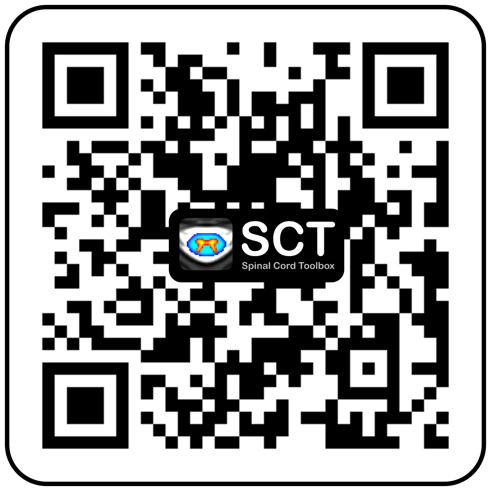

# ✈️ Conferences

## List of Conferences 

**Machine Learning:**

* [ICML](https://icml.cc/)
* NeurIPS
* MIDL

**Neuroimaging:**

* ISMRM
* OHBM
* MICCAI

**Medical Conferences:**

* ECTRIMS

### ISMRM 

* [2015 May 30-June 05, Toronto, ON, Canada](https://www.neuro.polymtl.ca/internal_resources/conferences/ismrm15)
* 2016 May 7-13, Singapore
* [2017 April 22–28, Honolulu, Hawaii, USA](https://www.neuro.polymtl.ca/internal_resources/conferences/ismrm17)
* [2018 April 14-20, Paris, France](https://www.neuro.polymtl.ca/internal_resources/conferences/ismrm18)
* 2019 May 11–17, Montreal, QC, Canada
* 2020 April 18-24, Sydney, NSW, Australia
* 2021 May 15-21, Virtual
* 2022 May 07-13, London, United Kingdom
* 2023 June 03-09, Toronto, ON, Canada

### OHBM 

* 2015 June 14-18, Honolulu, Hawaii, USA
* 2016 June 26-30, Geneva, Switzerland
* 2017 June 11-15, Vancouver, BC, Canada
* 2018 June 10-14, Seoul, South Korea
* 2019 June 8-14, Rome, Italy
* 2020, Montreal, Canada
* 2021, June 21-25, Virtual

### MICCAI 

* 2015 Oct 5-9, Munich, Germany
* 2016 Oct 17-21, Athens, Greece
* 2017 Sept 10-14, Quebec City, QC, Canada
* 2018 Sept 16-20, Granada, Spain
* 2019 TBD, Hong Kong, China
* 2020 TBD, San Miguel, Lima, Peru

### ECTRIMS 

* 2015 Oct 7-10, Barcelona, Spain
* 2016 Sept 14-17, London, UK
* 2017 Oct 25-28, Paris, France
* 2018 Oct, Berlin, Germany
* 2019 Sept, Stockholm, Sweden

### ISBI 

* 2017 Apr 18-21, Melbourne, Australia

### IEEE EMBS ISC 

* [2016 May 29-31, Ottawa, Canada](http://sites.ieee.org/embs-isc-2016/)

## Abstracts 

### Create Draft 

* Use Google Drive \(for sharing with authors and easy editing\)
  * Example here: [2018 ISMRM SyMR Repeatability](https://docs.google.com/document/d/1DM-94OFEmWYjskgAUJCFfTFNnzsTtXOAV_k7TFpSNPc/edit)
* Add figures at the end \(up to 5 figures\)
* more info here: [How to submit your new HTML-based ISMRM abstract](https://medium.com/@mrimark/how-to-submit-your-new-html-based-ismrm-abstract-a9cb2b159d4c)

### Share with Authors 

To send at least one week before the deadline:

Email title:

> &lt;CONFERENCE NAME&gt; abstract: &lt;TITLE\_OF\_YOUR\_ABSTRACT&gt;

Email body:

> Dear collaborators,
>
> It is our pleasure to share with you the latest draft of our &lt;CONFERENCE NAME&gt; abstract:

> &lt;URL\_TO\_GOOGLE\_DOC&gt;
>
> Please use "Suggesting mode" \(top right button\) if you would like to make changes or add comments. If possible, please sign in with your Google account so that changes are nominative. Please make modifications no later than &lt;DEADLINE MINUS\_ONE DAY&gt;.
>
> Kind regards,

**Upload on the website:**

* [Affiliations](https://neuropoly.gitbook.io/neuropoly-lab/publishing-articles#affiliations)
* Presentation format:
  * First choice: oral
  * Second choice: poster \(traditional or electronic\)
* Apply for stipend:
  * [ISMRM 2021 Stipend Programs](https://www.ismrm.org/21m/stipends/)
* Send formatted versions to all co-authors before submitting

## Talk 

Please use templates for presentations:

* [Keynote template](https://drive.google.com/file/d/1I7h7Fe-b5wOyzqFFHqskCGG5fXYwvCAV/view?usp=sharing)
* [PowerPoint template](https://docs.google.com/presentation/d/1iHf2i2CdAq4VjIh5CBADQnU00xJkDJHX/edit?usp=sharing&ouid=113015882791327478973&rtpof=true&sd=true)

## Posters 

For the visibility of the lab, please use this template in [Keynote](https://drive.google.com/open?id=1Nqn9u4-J6aNYTWLWY1pa28qRrBWSqxGs) or [PowerPoint](https://drive.google.com/open?id=12CkzxhUF6R8kHm2csfpIAL3vMxbkxV-R) format.

For ISMRM Electronic poster and presentation, please use this [Microsoft PowerPoint template](https://www.neuro.polymtl.ca/_media/internal_resources/template.pptx).

**How to do a poster?**

* [http://colinpurrington.com/tips/academic/posterdesign](http://colinpurrington.com/tips/academic/posterdesign)
* [http://betterposters.blogspot.co.uk/](http://betterposters.blogspot.co.uk/)
* [http://www.bandwidthonline.org/howdoi/effective\_poster.asp](http://www.bandwidthonline.org/howdoi/effective_poster.asp)
* [http://www.makesigns.com/tutorials/](http://www.makesigns.com/tutorials/)
* [http://www.scientifica.uk.com/neurowire/how-to-make-your-scientific-posters-stand-out](http://www.scientifica.uk.com/neurowire/how-to-make-your-scientific-posters-stand-out)

**What size should my poster be?**

The template provided **might not be the right size for you**. The size of your poster depends on the conference requirements \(usually listed on their website, or given to you by email\). Typically you want to print ~ 5cm smaller to make sure it fits on the board.

**Important**: respect the proportion of your poster when you export it to pdf. Do not add white bands on the side. E.g., if your poster is set to 1000×2000 voxels, then export to pdf with a ratio of 1:2.

If you wish to use your poster for several conferences, then print it in a way so that it fits the requirement of each conference \(e.g. if Conference \#1 asks for 30x20 inches and Conference \#2 asks for 25x28 inches, then print your poster at 23x18 inches\).

The reprography allows any size under 60 inches.

**Where to print your poster?**

Go to: Polytechnique Montreal Reprography, 2nd floor, main building. 

Order directly online using the form \(pay upon receipt\): [http://www.polymtl.ca/reprographie/](http://www.polymtl.ca/reprographie/)

**How to pay?**

They only accept cash. You have two payment options:

1. You pay cash when you get your poster and get the refund from the lab afterwards, on conference spending.
2. You fulfill the form “Demande au centre de reprographie” available at Marie-Claude Nadeau office \(M-5405\) and give it when you get your poster.

**QR Code on the poster**

Public access to the Spinal Cord Toolbox on SourceForge can be provided on the poster using this QR Code \(download the original image \(1000×1000\) to add to your poster\):

## Reimbursement 

The typical policy of the lab is that you can get your conference subscription reimbursed if you have something to present. If you don't, please ask your supervisor if they can reimburse the attendance.

You are reimbursed for:

* registration fees. ⚠️ ‎ The lab will only reimburse the cost of early fee. If you register late, you will have to pay the difference.
  * for ISMRM: make sure to be a student member– it reduces the overall cost of the conference– and make sure to do it ON TIME \(not last minute\)
* transport
* housing

You can be reimbursed by two means:

**A priori \(travel advance\)**

Send an email to `dge.sec-biomedical at polymtl dot ca` and ask them for a travel advance.

The amount of the advance is an estimate of all your eligible conference fees \(see above\).

Keep all your receipts and bank statement information \(if using debit or credit card\).

Once the conference is over, you have one month to claim the refunds.

**A posteriori**

Keep all your receipts and bank statement information\(if using debit or credit card\).

Once the conference is over, send an email to `dge.sec-biomedical at polymtl dot ca` with all your receipts.

N.B. You can not be reimbursed for expenses incurred before the conference. If you wish, ask for a travel advance.

