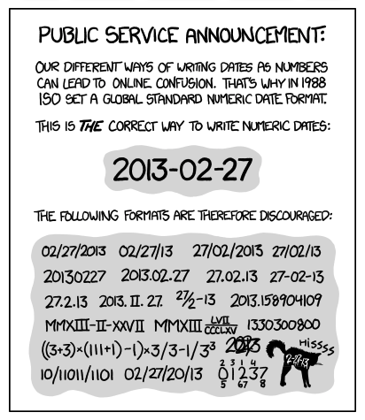

# Dropbox/Google Drive

This is the organization of each student's folder with Nikola and/or Julien. You can use Dropbox or Google Drive, but not both \(to avoid duplication\). Please let us know which one you want to use, then please organize folders as follows:

<table>
  <thead>
    <tr>
      <th style="text-align:left">Folder</th>
      <th style="text-align:left">Description</th>
    </tr>
  </thead>
  <tbody>
    <tr>
      <td style="text-align:left"><code>admin</code>
      </td>
      <td style="text-align:left">administrative stuff such as Polytechnique documents, grades, CV</td>
    </tr>
    <tr>
      <td style="text-align:left"><code>biblio</code>
      </td>
      <td style="text-align:left">not ALL your biblio, but some interesting stuff that we exchange temporarily</td>
    </tr>
    <tr>
      <td style="text-align:left"><code>conferences</code>
      </td>
      <td style="text-align:left">subfolder prefix is the date of the event, e.g. <b><code>20150530_ISMRM/</code></b>
      </td>
    </tr>
    <tr>
      <td style="text-align:left"><code>fellowships</code>
      </td>
      <td style="text-align:left">subfolder prefix is the date of the deadline, e.g. <b><code>20150314_FRQS/</code></b>
      </td>
    </tr>
    <tr>
      <td style="text-align:left"><code>manuscripts</code>
      </td>
      <td style="text-align:left">
        
subfolder name is year of first submission + journal, e.g. <b><code>2015_neuroimage/</code></b>
        

        <ul>
          <li>inside folder, organize by revisions, e.g. <b><code>r0/, r1/</code></b>,
            etc. Then:
            <ul>
              <li>have a folder <b><code>figures/</code></b>
              </li>
              <li>name your manuscript like: <b><code>manuscript_templateSpinalCord_r0_v00.docx</code></b>.
                Once you get feedback from someone, integrates comment and create file: <b><code>manuscript_templateSpinalCord_r0_v01.docx</code></b>
              </li>
            </ul>
          </li>
        </ul>
      </td>
    </tr>
    <tr>
      <td style="text-align:left"><code>misc</code>
      </td>
      <td style="text-align:left">Anything you want</td>
    </tr>
    <tr>
      <td style="text-align:left"><code>reports</code>
      </td>
      <td style="text-align:left">Include progress reports (format: Google Slides, pptx, keynote or pdf).
        Google Slides are preferred because comments can easily be added. Prefix
        name should start with YYYYMMDD_. Example: <b><code>20170515_report.pptx</code></b>
      </td>
    </tr>
    <tr>
      <td style="text-align:left"><code>results</code>
      </td>
      <td style="text-align:left">Snapshots/results of your experiments. Prefix should start with YYYYMMDD.
        Example: <b><code>20150120_dmri_nogse/</code></b>
      </td>
    </tr>
  </tbody>
</table>


**Note for Intern Students:** You will only need to create the `admin`, `biblio`, and `reports` folders.


**GENERAL RULES:**

* NEVER USE SPACE OR ACCENTS IN FILE NAMES! \(Unix-unfriendly\).
* Date format should always be `YYYYMMDD` \(or `YYYY-MM-DD`\). See this: [https://xkcd.com/1179/](https://xkcd.com/1179/)

Thank you 

P.S. For projects involving multiple students, a “project” folder is created under **`Google Drive/NeuroPoly/Projects`**.

